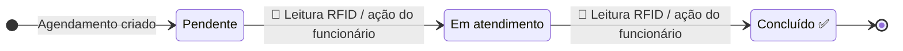
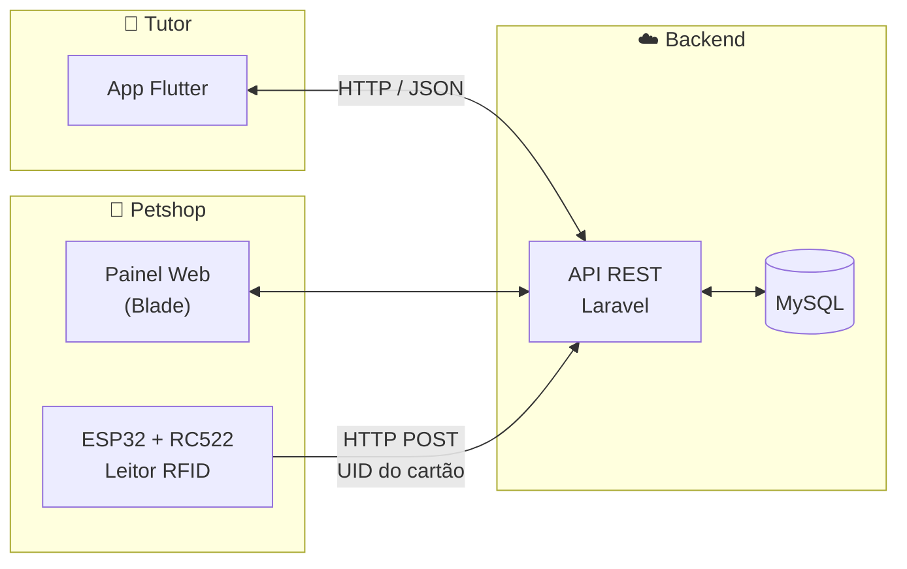
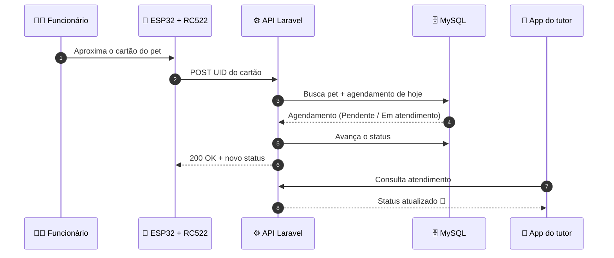
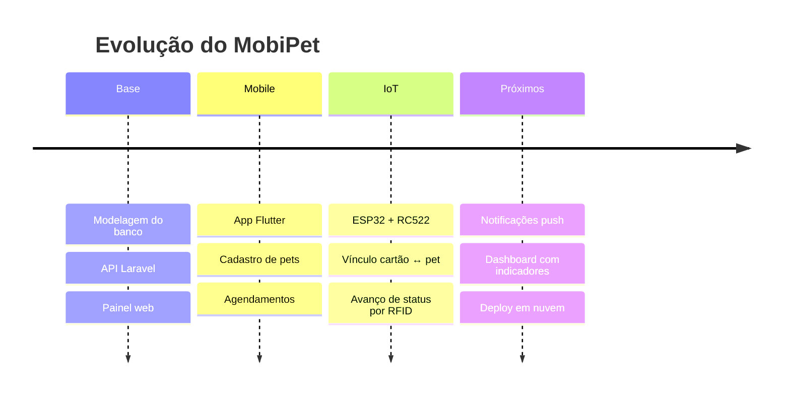

<div align="center">


<a href="https://git.io/typing-svg">
  
</a>

<br><br>

[](https://laravel.com/)
[](https://www.php.net/)
[](https://www.mysql.com/)
[](https://flutter.dev/)
[](https://dart.dev/)
[](https://www.espressif.com/)
[](https://www.arduino.cc/)


**Um ecossistema tecnológico que conecta petshops, tutores, pets e dispositivos IoT.**

[Sobre](#-sobre-o-projeto) •
[Funcionalidades](#-principais-funcionalidades) •
[Arquitetura](#%EF%B8%8F-arquitetura) •
[IoT / RFID](#-camada-iot--rfid) •
[Instalação](#%EF%B8%8F-como-executar) •
[Roadmap](#%EF%B8%8F-roadmap) •
[Autor](#-autor)

</div>

---

## 📌 Sobre o projeto

O **MobiPet** nasceu da necessidade de tornar o atendimento em petshops mais **organizado, tecnológico e transparente**.

Em um atendimento convencional, o tutor agenda um serviço, deixa o animal no estabelecimento e **espera sem saber em que etapa o atendimento está**. O MobiPet muda isso:

| 🏪 Petshop | 📱 Tutor | 📡 IoT |
|:--|:--|:--|
| Gerencia agendamentos, pets, clientes e funcionários em um painel web | Acompanha pelo app o status do atendimento em tempo real | Um cartão RFID identifica o pet e avança o atendimento com uma leitura |

> [!IMPORTANT]
> **O objetivo não é apenas administrar um petshop.** É conectar o estabelecimento, os profissionais, os pets e seus tutores em um **único ecossistema digital**.

---

## 🎯 Objetivos

- [x] 📅 Organizar agendamentos
- [x] 🐕 Gerenciar pets e tutores
- [x] 👨‍💼 Administrar funcionários e atendimentos
- [x] 📊 Centralizar informações operacionais
- [x] 📱 Permitir acompanhamento pelo aplicativo
- [x] 🔄 Atualizar o status dos serviços
- [ ] 📡 Integrar dispositivos IoT ao sistema
- [ ] 🪪 Identificar pets por RFID
- [ ] 📈 Apoiar a tomada de decisões com indicadores

> [!NOTE]
> Marque/desmarque os itens acima conforme o progresso real do projeto.

---

## 🚀 Principais funcionalidades

<table>
<tr>
<td width="50%" valign="top">

### 👤 Para tutores (App Flutter)

- 🐾 Cadastrar, visualizar e editar pets
- 📋 Consultar dados e histórico de atendimentos
- 📅 Realizar e acompanhar agendamentos
- 🔔 Acompanhar a evolução do serviço em tempo real

</td>
<td width="50%" valign="top">

### 🏪 Para o petshop (Painel Laravel)

- 🗓️ Gestão completa de agendamentos
- 👥 Cadastro de clientes, pets e funcionários
- 🔄 Controle do status de cada atendimento
- 🪪 Vínculo de cartões RFID aos pets

</td>
</tr>
</table>

### 🔔 Ciclo de vida do atendimento



<details>
<summary><b>📖 Visão do tutor (exemplo de etapas exibidas no app)</b></summary>

<br>

```text
🕐 Atendimento agendado
        ↓
⏳ Aguardando atendimento
        ↓
🛁 Banho em andamento
        ↓
✂️ Tosa em andamento
        ↓
✅ Serviço concluído
```

</details>

---

## 🏗️ Arquitetura



| Camada | Tecnologia | Responsabilidade |
|:--|:--|:--|
| **Backend** | Laravel · PHP | Regras de negócio, autenticação e API REST |
| **Banco de dados** | MySQL | Persistência de tutores, pets, agendamentos e cartões |
| **Mobile** | Flutter · Dart | Experiência do tutor e acompanhamento do atendimento |
| **IoT** | ESP32 · RC522 · C++ (Arduino) | Leitura dos cartões RFID e envio para a API |

---

## 📡 Camada IoT / RFID

Cada pet recebe um **cartão RFID**. Ao aproximar o cartão do leitor, o ESP32 envia o UID para a API, que localiza o **agendamento do dia** daquele pet e avança o status automaticamente.



<details>
<summary><b>🔌 Ligação ESP32 ↔ RC522 (SPI)</b></summary>

<br>

| RC522 | ESP32 |
|:--:|:--:|
| SDA (SS) | GPIO 5 |
| SCK | GPIO 18 |
| MOSI | GPIO 23 |
| MISO | GPIO 19 |
| RST | GPIO 22 |
| 3.3V | 3V3 |
| GND | GND |

> [!WARNING]
> O RC522 opera em **3.3V**. Ligá-lo em 5V pode danificar o módulo.

</details>

<details>
<summary><b>🪪 Cadastro de pet pelo ESP32</b></summary>

<br>

O funcionário pode cadastrar um pet diretamente pelo **Monitor Serial**, informando os dados do animal e o **ID do cliente**. Em seguida, aproxima um cartão novo, que fica vinculado ao pet recém-criado.

</details>

---

## 📂 Estrutura do repositório

```text
MobiPet/
├── 📁 backend/        # API e painel web em Laravel
├── 📁 mobile/         # Aplicativo Flutter do tutor
├── 📁 iot/            # Firmware do ESP32 (RC522)
└── 📄 README.md
```

> [!TIP]
> Ajuste a árvore acima para refletir os nomes reais das pastas do repositório.

---

## ⚙️ Como executar

### ✅ Pré-requisitos


<details open>
<summary><b>🐘 Backend (Laravel)</b></summary>

```bash
# Clone o repositório
git clone https://github.com/SEU-USUARIO/MobiPet.git
cd MobiPet/backend

# Instale as dependências
composer install

# Configure o ambiente
cp .env.example .env
php artisan key:generate

# Configure DB_DATABASE, DB_USERNAME e DB_PASSWORD no .env e rode:
php artisan migrate --seed

# Inicie o servidor (acessível na rede local para o ESP32 e o app)
php artisan serve --host=0.0.0.0 --port=8000
```

</details>

<details>
<summary><b>💙 Mobile (Flutter)</b></summary>

```bash
cd MobiPet/mobile
flutter pub get

# Aponte a URL base da API para o IP da sua máquina (ex.: http://192.168.0.10:8000)
flutter run
```

</details>

<details>
<summary><b>📡 IoT (ESP32)</b></summary>

1. Instale o pacote de placas **ESP32** na Arduino IDE.
2. Instale a biblioteca **MFRC522**.
3. No firmware, configure:
   ```cpp
   const char* WIFI_SSID     = "SUA_REDE";
   const char* WIFI_PASSWORD = "SUA_SENHA";
   const char* API_URL       = "http://192.168.0.10:8000/api/...";
   ```
4. Faça o upload para a placa e abra o **Monitor Serial** (115200 baud).

</details>

> [!CAUTION]
> Nunca faça commit do arquivo `.env` nem de senhas de Wi-Fi no firmware.

---

## 🗺️ Roadmap



---

## 🧠 Aprendizados

- Integração entre **três plataformas** distintas (web, mobile e embarcado) através de uma única API.
- Modelagem de um **fluxo de status** consistente compartilhado entre funcionário, tutor e hardware.
- Comunicação **HTTP a partir de microcontroladores** e tratamento de falhas de rede.

---

## 👨‍💻 Autor

<div align="center">

<a href="https://github.com/SEU-USUARIO">
  
</a>

**Arthur**
Estudante de Análise e Desenvolvimento de Sistemas · SENAI

[](https://github.com/SEU-USUARIO)
[](https://linkedin.com/in/SEU-USUARIO)
[](https://SEU-PORTFOLIO)

</div>

---

<div align="center">

**Feito com 💙 e muito ☕ como Trabalho de Conclusão de Curso.**

⭐ Se este projeto te ajudou ou te inspirou, deixe uma estrela!


</div>
